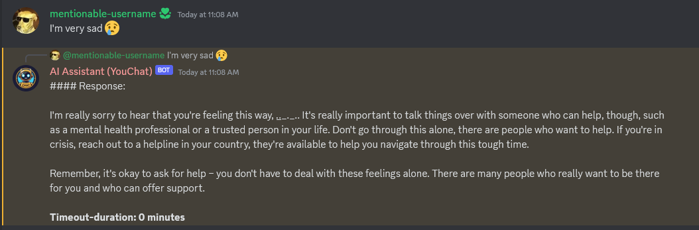
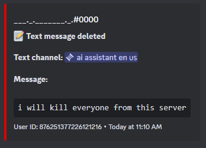
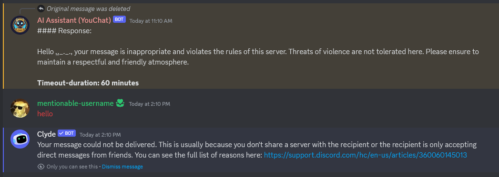
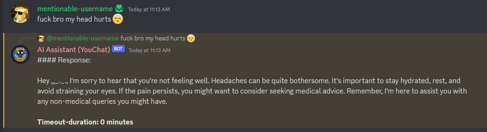
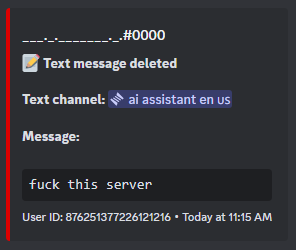
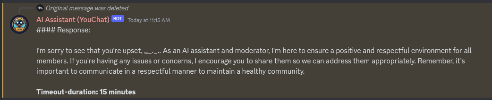

# Simple Discord Bot with AI and Moderation 
[](https://discord.gg/pfa6RVxxUM) [](https://opensource.org/licenses/MIT)
# Uhhh what is this?
This is a simple Discord bot made in Python that uses [this API](https://api.freegpt4.ddns.net/) (GPT-4) for text generation.

# ok, what can it do?
It can:

- The bot replies to the user when they mention, reply or say "youchat".
- The bot uses [VADER-Sentiment-Analysis](https://github.com/cjhutto/vaderSentiment) for detecting negative messages and apply moderation, if message was offensive or harmful.
- The bot can detect badwords, deletes the user message and apply timeout automatically (but only if the user's message is intended to be offensive/harmful).
- The bot can read chat history (but with limitations).
- the bot can decide for itself how long the user will be in timeout, depending on the severity of the message.

Regarding automatic moderation, not every message that the bot detects negative or has a bad word will block it and apply timeout to the user, this will depend on whether the message was intended to be offensive/harmful or not (As you can see in pictures below).

# Picture examples
- Sentiment analyzer:
  




- Badwords filtering:





# How to start?

- Make a `.env` file and inside it put your bot token, like this:

`.env`:
```
TOKEN=your-bot-token
```
- after that, run:
```sh
pip install -r requirements.txt
```
- and then:
```sh
python index.py
```

- You can modify `badwords.txt` (add or remove words) for your own needs.
- In this line (`index.py`), you can add user IDs that the bot will ignore from automod, for example your server staff members (admins, moderators...):
```python
exempt_user_ids = [775678427511783434] # list of IDs that will not be blocked by bot's automod (Server owner, staff members...)
```
- In this line (`index.py`), you can modify things like changing to your own username (assuming you own the server), and other information.
```python
# Bot Variables
chat_history_limit = 50 # Defaults to 50 last messages in chat history (But it won't use the last 50 messages due characters limitation)
server_owner = "creitingameplays" # Replace with your username
role = "Server AI Assistant and Moderator you can only delete offensive/harmful messages and you timeout when detected"
note = "PLEASE DO NOT generate large messages in chat."
note_warn = "At the end of your message, say (ONLY in minutes) how long the user will be timed-out (you can timeout). If you think the user doesn't deserve the timeout, it was a false positive or wasn't intended to be offensive/harmful, PLEASE SAY 'Timeout-duration: 0 minutes', please. You can use Chat History for moderation."
```

# why would I use this huh 

it can be useful like if your server has few moderators or if they cannot be very active.
yeah

# why did i do this thing?

idk I was bored and I had this idea lol.
I did this whole code using [Google Gemini](https://gemini.google.com/) (Gemini was the coder lmao) and I modified tiny things in the code.

### ✨✨ [My Discord Server](https://discord.gg/pfa6RVxxUM) ✨✨
